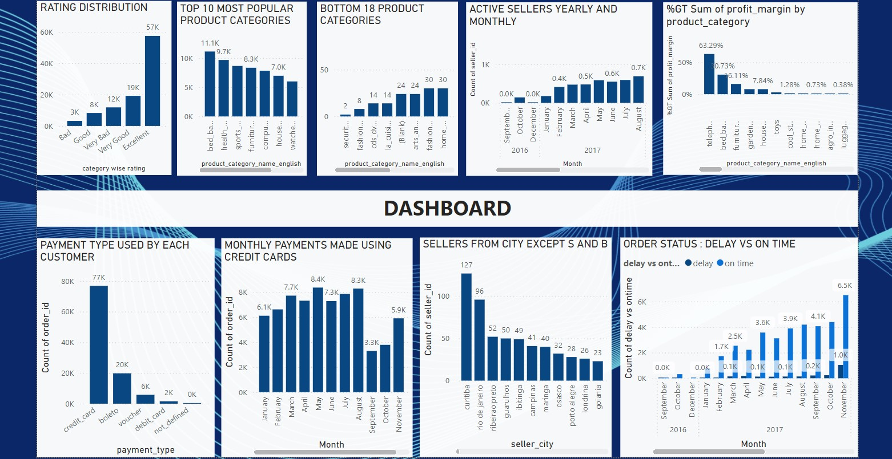

# Data_Decoded
### Welcome to My Data Analytics Portfolio 🚀

This repository showcases the key data analytics projects I have worked on, using tools and techniques like **Excel**, **SQL**, **Power BI**, and **funnel analysis**. Each project demonstrates problem-solving abilities, data-driven insights, and actionable recommendations. Here's a snapshot of the projects:

1. **Supermarket Sales Analysis (Excel)**
-  Analyze transaction data to identify order patterns and areas with highest growth in monthly orders.
-	Calculate delivery charges, discounts, and average revenue across slots, areas, and customer sources.
-	Evaluated completion rates by time slots, delivery areas, and order size to identify trends.
-	Optimized delivery efficiency by uncovering patterns in delivery time across areas and time slots.

2. **SQL PROJECT**  
-	 Analyze the Airline DB to understand flight operations and customer patterns.
-	Generate SQL queries to explore flight details, passenger behaviors, and operational metrics.
-	Utilized SQL techniques such as joins, aggregations, and window functions to extract meaningful insights.
-	Delivered valuable insights on trends like flight cancellations, passenger spending and seat allocation for enhanced decision-making.

3. **Funnel Analysis**
-  Company needed to optimize order volume, traffic, and conversion metrics.
-	Analyze session data to identify significant order changes, traffic shifts, and conversion rate fluctuations.
-	Analyzed data, revealing a 60% increase in orders and a 30% dip in weekend traffic.
-	Delivered actionable insights, improving traffic, reducing order drops by 44%, and enhancing conversions.

4. **Interactive Dashboard (Power BI)**  
-   The store needs to optimize decision-making and logistics. 
-	 Create a Power BI dashboard to visualize key business metrics.
-	 Developed interactive visuals, analyzed product margins, and integrated delivery insights.
-	Improved decision efficiency, reduced logistics delays, optimized product focus, and boosted credit card transactions.
  
  

     
      
